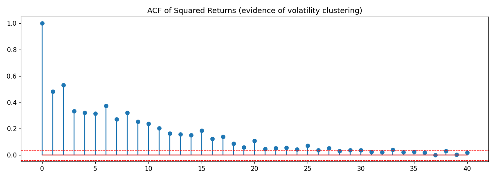
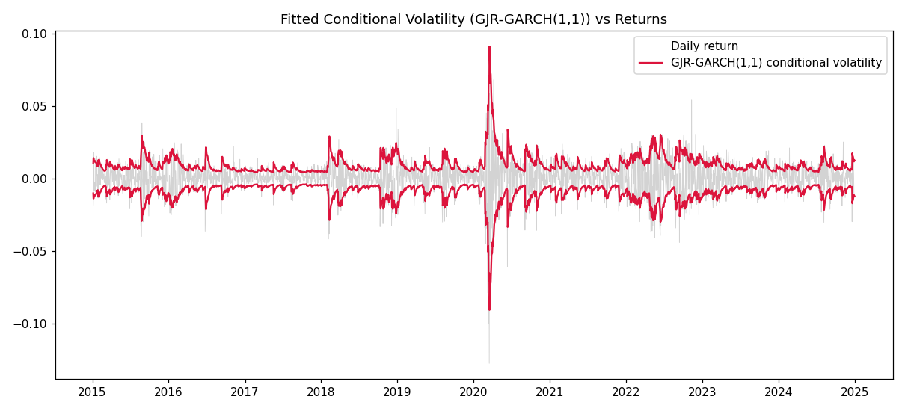
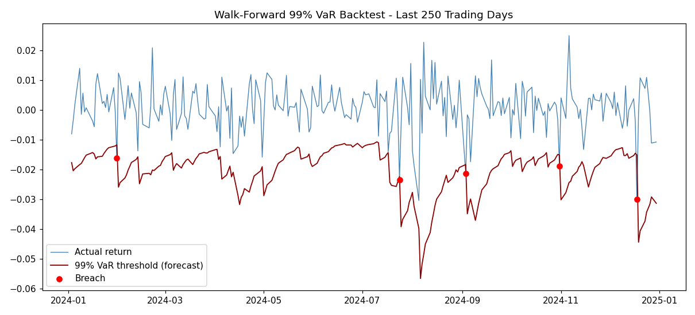

# GARCH-Based Volatility Forecasting and VaR Backtesting

## Overview

This project develops an end-to-end volatility forecasting and market risk analysis pipeline using daily S&P 500 returns.

The project investigates volatility clustering, compares three GARCH-family models, selects the preferred specification using
AIC/BIC, forecasts volatility out-of-sample, and evaluates 99% Value-at-Risk (VaR) forecasts using walk-forward backtesting.

## Objectives

- Download and process historical S&P 500 data
- Calculate daily log returns
- Test return stationarity using the Augmented Dickey-Fuller (ADF) test
- Detect volatility clustering using squared-return diagnostics
- Fit GARCH, EGARCH and GJR-GARCH models
- Compare models using AIC and BIC
- Select the preferred volatility model
- Forecast volatility out-of-sample
- Estimate 99% Value-at-Risk
- Backtest VaR forecasts
- Evaluate VaR coverage using the Kupiec test

---

## Project Pipeline

                 S&P 500
                    │
                    ▼
            Historical prices
                    │
                    ▼
              Log returns
                    │
                    ▼
        ┌──────────────────────┐
        │ Stationarity testing │
        │        ADF           │
        └──────────┬───────────┘
                   │
                   ▼
        ┌──────────────────────┐
        │ Volatility diagnostics│
        │ Ljung-Box + ACF       │
        └──────────┬───────────┘
                   │
                   ▼
       ┌──────────────────────────┐
       │  GARCH-family models     │
       │                          │
       │ GARCH                    │
       │ EGARCH                   │
       │ GJR-GARCH                │
       └────────────┬─────────────┘
                    │
                    ▼
             AIC / BIC comparison
                    │
                    ▼
              Best model
                    │
                    ▼
          Walk-forward forecasting
                    │
                    ▼
                99% VaR
                    │
                    ▼
             VaR backtesting
                    │
                    ▼
             Kupiec test

---

## Dataset

**Asset:** S&P 500 Index (^GSPC)

**Source:** Yahoo Finance

**Frequency:** Daily

**Period:** 2015–2024

The data is downloaded programmatically using `yfinance`, so the
raw dataset does not need to be stored in the repository.

---

## Methodology

### 1. Return Calculation

Daily log returns are calculated as:

r_t = ln(P_t / P_{t-1})

where P_t is the closing price on day t.

### 2. Stationarity

The Augmented Dickey-Fuller test is applied to the return series.

The null hypothesis is that the series contains a unit root.

### 3. Volatility Clustering

Squared returns are analyzed using:

- Ljung-Box test
- Autocorrelation Function (ACF)

Significant autocorrelation in squared returns provides evidence of
volatility clustering.

### 4. Volatility Models

Three conditional volatility models are estimated:

- GARCH(1,1)
- EGARCH(1,1)
- GJR-GARCH(1,1)

Student-t innovations are used to account for heavier-tailed
financial return distributions.

### 5. Model Selection

Models are compared using:

- Log-likelihood
- AIC
- BIC

The model with the lowest BIC is selected as the preferred model.

### 6. Out-of-Sample Forecasting

A walk-forward forecasting procedure is used to generate
one-step-ahead volatility forecasts.

### 7. Value-at-Risk

A 99% one-sided VaR threshold is calculated from the volatility
forecast and Student-t distribution.

### 8. VaR Backtesting

The final 250 trading days are used as the out-of-sample
backtesting period.

Observed VaR breaches are compared with the expected number
of breaches under a 99% confidence level.

The Kupiec unconditional coverage test is used to assess whether
the observed breach rate is statistically consistent with the
target VaR level.

---

## Results

### Stationarity

ADF statistic: **-15.730**

The p-value is extremely small, leading to rejection of the
unit-root null hypothesis.

**Conclusion:** The return series is stationary.

### Volatility Clustering

The Ljung-Box test on squared returns produces extremely small
p-values at lags 10 and 20.

**Conclusion:** There is strong evidence of autocorrelation in
squared returns and therefore volatility clustering.

### Model Comparison

| Model | AIC | BIC |
|---|---:|---:|
| GARCH(1,1) | 6305.81 | 6334.96 |
| EGARCH(1,1) | 6318.65 | 6347.80 |
| GJR-GARCH(1,1) | 6233.80 | **6268.78** |

**Preferred model: GJR-GARCH(1,1)** based on BIC.

### VaR Backtest

Confidence level: **99%**

Backtesting window: **250 trading days**

Expected breaches: **~2.5**

Observed breaches: **5**

Observed breach rate: **2.00%**

Kupiec test p-value: **0.162**

---

## Visualizations

### Squared Returns ACF



### Conditional Volatility



### VaR Backtest



---

## Technologies

- Python
- NumPy
- Pandas
- Matplotlib
- SciPy
- Statsmodels
- ARCH
- yfinance
- Jupyter Notebook

---

## Repository Structure

```text
GARCH-Volatility-Forecasting-VaR/
│
├── README.md
├── requirements.txt
├── .gitignore
│
├── notebooks/
│   └── GARCH_Family_Forecasting_and_VaR_Backtesting.ipynb
│
├── results/
│   ├── step2_sq_returns_acf.png
│   ├── step4_conditional_vol.png
│   └── step5_var_backtest.png
│
└── docs/
    └── methodology.md
